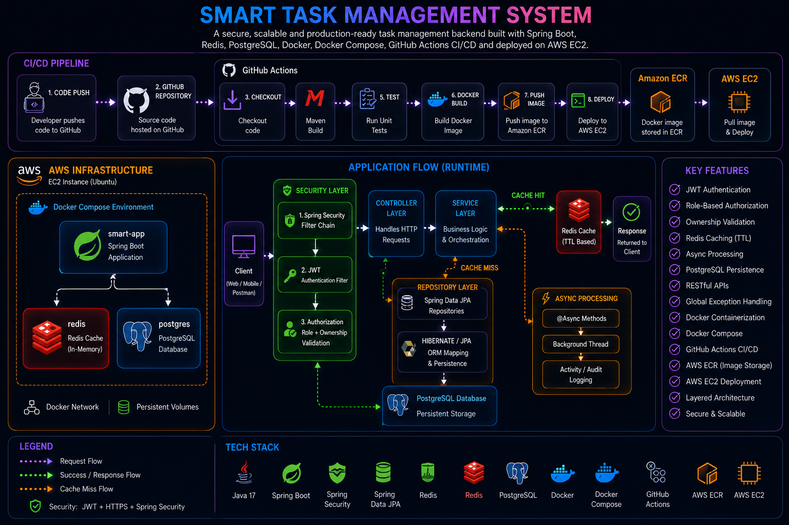

# 🚀 Smart Task Management System

A production-oriented backend application built using **Spring Boot** that enables users to securely manage projects and tasks. The system implements **JWT Authentication**, **Role-Based Authorization**, **Redis Caching**, **Asynchronous Processing**, **Docker Containerization**, **CI/CD Automation**, and **AWS Deployment**.

---

## 🏗️ Architecture



---

## ✨ Features

- 🔐 JWT Authentication & Authorization
- 👤 Ownership-Based Access Control
- 📂 User, Project & Task Management
- ⚡ Redis Caching with TTL
- 🔄 Async Processing using `@Async`
- 🛡️ Spring Security Integration
- 🗄️ PostgreSQL Persistence
- 🐳 Docker & Docker Compose
- 🚀 CI/CD with GitHub Actions
- ☁️ AWS EC2 Deployment
- 📦 Amazon ECR Integration
- 🌐 RESTful APIs
- ⚠️ Global Exception Handling

---

## 🛠️ Tech Stack

### Backend
- Java 17/21
- Spring Boot
- Spring Security
- Spring Data JPA
- Hibernate

### Database
- PostgreSQL

### Cache
- Redis

### DevOps & Cloud
- Docker
- Docker Compose
- GitHub Actions
- AWS EC2
- Amazon ECR

### Security
- JWT Authentication
- Role-Based Authorization

---

## 📂 Project Structure

```text
src/main/java/com/smart

├── controller
├── service
├── repository
├── entity
├── dto
├── security
├── exception
└── config
```

---

## 🔄 CI/CD Pipeline

```text
Developer
    │
    ▼
Git Push
    │
    ▼
GitHub Repository
    │
    ▼
GitHub Actions
    │
    ├── Checkout Code
    ├── Maven Build
    ├── Run Tests
    ├── Docker Build
    ├── Push Image to Amazon ECR
    └── Deploy to AWS EC2
```

---

## ☁️ Deployment Architecture

```text
AWS EC2
│
└── Docker Compose
      ├── smart-app (Spring Boot)
      ├── postgres (PostgreSQL)
      └── redis (Redis Cache)
```

---

## 📡 API Endpoints

### Authentication APIs

| Method | Endpoint | Description |
|----------|----------|-------------|
| POST | /auth/login | Authenticate user and generate JWT token |

---

### User APIs

| Method | Endpoint | Description |
|----------|----------|-------------|
| POST | /users | Create new user |
| GET | /users/{id} | Get user by ID |
| GET | /users | Get all users |
| PUT | /users/{id} | Update user |
| DELETE | /users/{id} | Delete user |

---

### Project APIs

| Method | Endpoint | Description |
|----------|----------|-------------|
| POST | /projects | Create project |
| GET | /projects/{id} | Get project by ID |
| GET | /projects | Get all projects |
| GET | /projects/user/{userId} | Get projects by user |
| PUT | /projects/{id} | Update project |
| DELETE | /projects/{id} | Delete project |

---

### Task APIs

| Method | Endpoint | Description |
|----------|----------|-------------|
| POST | /tasks | Create task |
| GET | /tasks/{id} | Get task by ID |
| GET | /tasks | Get all tasks |
| GET | /tasks/project/{projectId} | Get tasks by project |
| GET | /tasks/user/{userId} | Get tasks assigned to user |
| PUT | /tasks/{id} | Update task |
| DELETE | /tasks/{id} | Delete task |

## 🔄 Async Processing

```text
Service Layer
      │
      ▼
    @Async
      │
      ▼
Background Thread
      │
      ▼
Activity Logging
```

---

## 🚀 Run Locally

```bash
git clone <https://github.com/Nikil1717/smart-task-backend.git>

cd smart-task

docker compose up --build
```

Application will be available at:

```text
http://localhost:8080
```

---

## 🎯 Key Learnings

- Spring Boot Development
- REST API Design
- JWT Authentication & Authorization
- Spring Security
- Redis Caching
- Async Processing
- Docker & Docker Compose
- GitHub Actions CI/CD
- AWS EC2 Deployment
- Amazon ECR
- PostgreSQL
- Production Deployment Practices

---

## 👨‍💻 Author

**Nikil T M**

Java • Spring Boot • AWS • Docker • CI/CD • Backend Development

⭐ If you found this project interesting, consider giving it a star.
